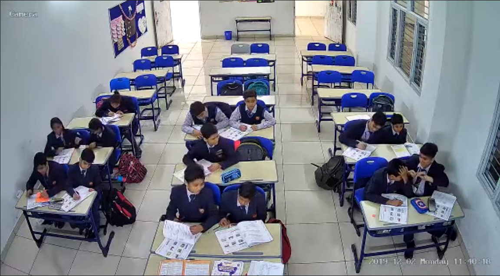
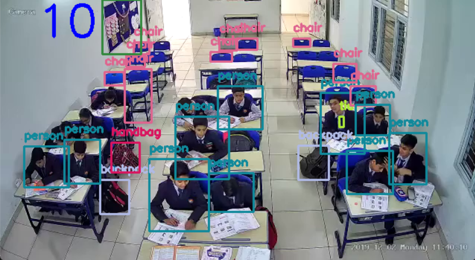

# Classroom CCTV analysis


### Problem Statement
The conventional approach to monitoring large areas like classrooms using CCTV cameras often involves manual observation, which is time-consuming and prone to human error. We also find instances of errors during attendance in such cases. This project aims to automate object detection, mainly aimed towards detecting the number of students in a classroom using the CCTV footage of the classroom addressing the need for efficient and accurate surveillance in various domains. 

## Project Description
This project leverages the cvlib library to enable real-time object detection in CCTV footage. By utilizing a pre-trained model, the system identifies common objects in the video stream and draws bounding boxes around them. This visual representation enhances surveillance capabilities, making it valuable for applications such as security monitoring, crowd analysis, and behavior recognition. In our instance we use this for monitoring the number of students in the class which reduces the errors in attendace and enhances the security and surveillance of the classroom.

### How this project Helps
- Real-time Object Detection: The project offers real-time detection of common objects, providing instant feedback on the contents of the surveillance footage.

- Automated Surveillance: By automating object detection, the system reduces the reliance on manual monitoring, allowing for more effective and timely responses to potential security incidents.

- OpenCV Integration: Utilizing OpenCV for video processing ensures compatibility with a wide range of cameras and video sources, making it adaptable to diverse surveillance setups.

## Advantages
1. Ease of Use: The project is built on cvlib, a user-friendly computer vision library that simplifies the process of integrating object detection into applications.

2. Customization: Developers can easily adapt the project for specific use cases by adjusting parameters, integrating custom pre-trained models, or modifying the visualization components.

3. Real-time Feedback: The visual feedback provided by the bounding boxes allows users to quickly analyze the surveillance footage without the need for extensive manual review.

4. Open Source: Being an open-source project, it encourages collaboration and contributions from the community, fostering continuous improvement and innovation.

## Disadvantages
1. Limited Object Recognition: The system's performance is contingent on the pre-trained model's ability to recognize common objects. Less common or highly specific objects may not be detected accurately.

2. Resource Intensive: Real-time object detection can be computationally demanding, potentially requiring robust hardware for optimal performance, especially in scenarios with multiple cameras.

3. False Positives/Negatives: Like any object detection system, there is a chance of false positives (incorrectly identifying an object) or false negatives (failing to identify an existing object), impacting the system's reliability.

4. Dependency on Lighting Conditions: The accuracy of object detection may vary based on lighting conditions, and certain objects might be more challenging to detect in low-light environments.

## Future Scope
* Improved Object Recognition: Future development can focus on enhancing the model's capabilities to recognize a broader range of objects and improving accuracy in challenging scenarios.

* Integration with Alerts: Implementing an alert system that triggers notifications for specific events or object detections could enhance the system's utility in real-world applications.
## Screenshots
### Orignal CCTV video footage


### Output video footage
The numbers to the corner represent the number of students present currently


## How to Run the project

Clone the project

```bash
  git clone https://link-to-project
```

Go to the project directory

```bash
  cd project/root
```

Install dependencies

```bash
  pip install -r requirements.txt
```

Run the main.py file in src

```bash
  python main.py 
```
If you want to add new CCTV footages add them into the 'data' folder in the root directory and update the main.py file

## FAQ
### How do I run this on my system
Please follow the instructions given above in the 'How to Run the project' section

### Can I use my own pre-trained models for object detection?
Yes. The detection algorithm can be updated in the 'detection.py' program in the 'root/src' folder

### The video is not able to load or display correctly
- Please ensure that the correct path to the video is used. It is advised that you should place all the video footages in the root/data folder and use the path in the program
- Ensure that you have followed all the steps correctly to run the project and all the dependencies are correctly installed on your system
